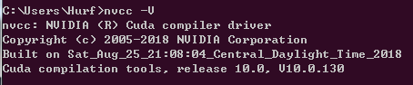
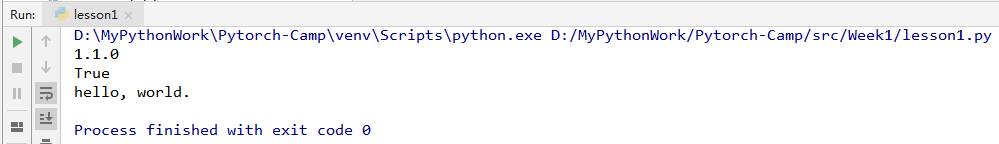
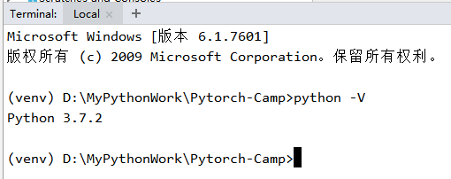

# 《Pytorch框架班》训练营

## 课程资料
- [Pytorch中文文档地址](https://github.com/zergtant/pytorch-handbook)：本文档介绍了最新的Pytorch1.1的API
- [《Pytorch模型训练实用教程》中配套代码](https://github.com/tensor-yu/PyTorch_Tutorial)
- 本训练营的学习安排与课程任务：详见文件夹Books中的《PyTorch框架班作业（第一期）》doc文档

## 课程安排
**总课时：6 周**

### 第一周
- 1 Pytorch简介，配置电脑环境
- 2 学习序列化模型、torch接口
- 3 深入了解torch接口

### 第二周
- 4 torch.Storage、torch.cuda操作
- 5 数据读取、数据扩增
- 6 构建网络模型

### 第三周
- 7 网络模型参数初始化
- 8 损失函数
- 9 优化算法torch.optim

### 第四周
- 10 设置学习率
- 11 数据可视化 

### 第五周
- 12 Logistics分类实战
- 13 多层感知机MLP实战
- 14 卷积神经网络CNN：Resnet18
- 15 递归神经网络RNN-LSTM：词性预测

### 第六周
- 16 CNN卷积神经网络：定位检测实战
- 17 GAN项目实战
- 18 开始一个简单的图像分类比赛(kaggle 猫狗识别)
- 19 期末总结

## 总结
&emsp;&emsp;老师给的是Pytorch0.4的API资料，配合Pytorch1.1的代码，能更好的学习API的使用。第五周的课程，如果采用单机运行，可能由于算力不够，需要等待很长的时间。建议搭建Google Colab，需要采用科学上网。  
&emsp;&emsp;由于笔者还不会深度学习，只能先通过查看Pytorch的API示例，学习框架的使用，并逐步改写代码。目标下一次要完成《吴恩达深度学习教程》和《深度学习》花书。  
&emsp;&emsp;requirements.txt文件是笔者自己的环境，配置环境如下：  
- CUDA安装的是10.0版本  

- torch版本  

- python版本  
